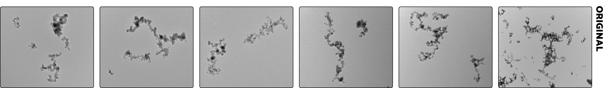

# ATEMS

**(*A*nalysis tools for *TEM* images of *S*oot)**

[](https://lbesson.mit-license.org/)
[]()

This codebase contains Matlab code for several methods of characterizing soot aggregates in TEM images. This includes methods for evaluating the aggregate projected area, perimeter, and primary particle diameter. Methods include Otsu thresholding, the pair correlation method (PCM), Hough circle transform (following [Kook](kook)), and tools to aid in manual analysis. The program is primarily composed of two analysis packages, which will be discussed later in the README: 

1. **+agg** - which performs aggregate-level segmentation to output a binary image, and 
2. **+pp** - which determines the primarily particle, often from the binary image generated by the methods in the **agg** package noted above. 

Functions in these packages are called by prefacing the function name with the package name, e.g. PCM can be called used `pp.pcm`. 

### Getting started

#### Load images

The first step in the image analysis process is to import images. Images can be handled in one of two ways. The first is as a Matlab structure, with one entry in the structure for each image loaded. To generate this structure by loading the sample images provided with the program, one can use the `tools.load_imgs` function as follows:

```Matlab
Imgs = tools.load_imgs('images'); % load the images
```

The output structure contains the image file name and directory; the image itself, with the footer cropped; and the pixel size, read from the image footer. The latter two operations make use of the get_footer_scale function, which requires a certain style footer that is consistent with TEM images taken at the University of British Columbia and applies optical character recognition to determine the pixel size (stored in the `pixsize` field). One can also generate by selecting files in a file explorer by omitting the string input: 

```Matlab
Imgs = tools.load_imgs; % load the images
```

The second way images can be handled is using a cell array of cropped images and pixel sizes. These are secondary outputs to the load_imgs function: 

```Matlab
[Imgs, imgs, pixsizes] = tools.load_imgs('images'); % load the images
```

The images and pixel sizes can also be extracted from the `Imgs` structure using:

```Matlab
imgs = {Imgs.cropped}; % copy variables locally
pixsize = [Imgs.pixsize]; % pixel size for each image
fname = {Imgs.fname};
```

#### Aggregate-level segmentation

The next step is to evaluate binaries that separate the image into pixels that are part of the background and pixels that are part of aggregates. This is done using the functions in the **agg** package. For example, a *k*-means segmentation specific to this problem can be performed using:

```Matlab
imgs_binary = agg.seg_kmeans(imgs, pixsize, opts);
    % segment aggregates
```

The result, `imgs_binary`, is either a single binary image (if one image is given as an input) or a cellular array of image binaries (if multiple images are given as an input), with `1` if a pixel is considered part of the aggregate and `0` if it is not. Other approaches are also available and are discussed in Section 1 below. 

Having segmented the image, aggregate characteristics can be determined by passing this binary image to an analysis function:

```Matlab
Aggs = agg.analyze_binary(...
    imgs_binary,imgs,pixsize,fname);
        % determine aggregate properties
```

The output data itself, `Aggs`, is a MATLAB structure with one entry per aggregate, containing properties like the location of the aggregate, perimeter, and projected-area. This data can then be exported to a JSON file using :

```Matlab
tools.write_json(Aggs, fname);
```

or an Excel spreadsheet using: 

```Matlab
tools.write_excel(Aggs, fname);
```

to be analyzed in other software and languages, where `fname` is the filename of the file to write to. The `Aggs` structure can also be visualized as an overlay on top of the TEM image using

```Matlab
figure(1);
tools.imshow_agg(Aggs);
```

The resultant image highlights pixels that are part of the aggregate, and plots a circle that corresponds to the radius of gyration. This output is similar to that shown in images above for the *k*-means and the manual slider methods above. 

#### Determining the primary particle size

Primary particle size information can finally be determined using functions in the **pp** package. The original pair correlation method (PCM), for example, can be applied by using the `Aggs` output from the `agg.analyze_binary` function as

```Matlab
Aggs_pcm = pp.pcm(Aggs); % apply PCM
```

The output is an updated `Aggs` structure that also contains an estimate of the primary particle size for each aggregate. Having done this, the primary particle size can be visualized along with the radius of gyration noted above by passing the updates `Aggs` structure to the `tools.plot_aggregates` function:

```Matlab
figure(1);
tools.imshow_agg(Aggs_pcm);
```

The inner circle now indicates the primary particle size from PCM, and the number indicating the index used by the program to identify each aggregate. 

## 1. Aggregate segmentation package (+agg)

This package contains an expanding library of functions aimed at performing semantic segmentation of the TEM images into aggregate and background areas. To demonstrate, we will consider a set of size sample images. 



These images are included with this distribution in the `images/` folder. These images represent soot collected from a lab-scale flare [(Trivanovic et al., 2020)][triv20] and a diesel engine. 

### 1.1 agg.seg* functions

The main functions implementing aggregate-level semantic segmentation have filenames following `agg.seg*`. In each case, the output primarily consists of binary images of the same size as the original image but where pixels taken on logical values: `1` for pixels identified as part of the aggregate `0` for pixels identified as part of the background. The functions often take similar inputs, with main argument being `imgs`, which is one of:

1. a single image (after any footer or additional information have been removed), 
2. a cellular array of images (again with the footer removed); or
3. an `Imgs` structure, containing the image information as fields. 

Several methods also take `pixsize`, which denotes the size of each pixel in the image. If an `Imgs` structure if provided, this information is expected to be contained in this structure and any `pixsize` input is ignored. Other arguments depend on the function (e.g., optional parameters for the rolling ball transform). 

The set of available methods is summarized below. 

#### A general segmenter: seg

The `agg.seg` function is a general, multipurpose wrapper function that attempts several methods listed here in sequence, prompting the user after each attempt. This includes an allowance to refine output from the fully automated *k*-means and Otsu-based methods discussed below, using a manual thresholding of small regions of the image. 

#### seg_kmeans

This function applies a *k*-means segmentation approach using three feature layers, which include (*i*) a denoised version of the image, (*ii*) a measure of texture in the image, and (*iii*) an Otsu-like threshold, adjusted upwards. Compiling these different feature layers results in segmentation that effectively consider colour images, if each of the layers are assigned a colour. For example, compilation of these feature layers could be visualized as: 


Applying Matlab's `imsegkmeans` function will then result in segmentations as follows: 


While this may be adequate for many users, this technique occasionally fails, particularly if the function does not adequately remove the background. 

#### seg_otsu_rb*

These automated methods apply Otsu thresholding followed by a rolling ball transformation. Two versions of this function are included: 

1. **seg_otsu_rb_orig** - Remains more true to the original code of [Dastanpour et al. (2016)][dastanpour2016]. 
2. **seg_otsu_rb** - Updates the above implementation by (*i*) not immediately removing boundary aggregates, (*ii*) adding a background subtraction step using the `agg.bg_subtract` function, and (*iii*) adding a bilateral denoising step. 

Sample images from the original and updated procedure, respectively, are shown below. 


The latter function generally performs better, though both often break up aggregates and should likely be compliment with some manual adjustments following initial thresholding. 

#### Manually adjusting the threshold: seg_slider

The function `agg.seg_slider` enacts a GUI-based method with a slider for adaptive, manual thresholding of the image (*adaptive* in that small sections of the image can be cropped and assigned individually-selected thresholds). This is done in several steps. Gaussian blurring is first performed on the image to reduce the noise in the output binary image. Then, a slider is used to manually adjust the level of the threshold in the cropped region of the image. This can result in segmentations like:


It is worth noting that the manual nature of this approach will resulting in variability and subjectiveness between users. However, the human input often greatly improves the quality of the segmentations and, while more time-intensive, can act as a reference in considering the appropriateness of the other segmentation methods. 

Several sub-functions are included within the main file. This is a variant of the method included with the distribution of the PCM code by [Dastanpour et al. (2016)][dastanpour2016]. 

> We note that this code saw important bug updates since the original code by [Dastanpour et al. (2016)][dastanpour2016]. This includes fixing how the original code would repeatedly apply a Gaussian filter every time the user interacted with the slider in the GUI (which may cause some backward compatibility issues), a reduction in the use of global variables, memory savings, and other performance improvements. 

### 1.2 analyze_binary

Having produced a binary image by any of the above functions, the `agg.analyze_binary` function is used to convert these binaries to aggregate characteristics, such as area in pixels, radius of gyration, area-equivalent diameter, aspect ratio, etc.. The function itself takes a binary image, the original image, and the pixel size as inputs, e.g., 

```Matlab
Aggs = agg.analyze_binary(imgs_binary,imgs,pixsize,fname);
```

The output is a MATLAB structured array, `Aggs`, containing information about the aggregate. The array has one entry for each aggregate found in the image, which is itself defined as any independent groupings of pixels. 

The `fname` argument is optional and adds this tag to the information in the output `Aggs` structure. 

### 1.3 rolling_ball

Multiple of these methods make use of the *rolling ball transformation*, applied using the `agg.rolling_ball` function included with this package. This transform fills in gaps inside aggregates, acting as a kind of noise filter. This is accomplished by way iterative morphological opening and closing. 

## 2. Primary particle analysis package (+pp)

The +pp package contains multiple methods for determining the primary particle size of the aggregates of interest. Often this requires a binary mask of the image that can be generated using the +agg package methods.

#### PCM

The `pp.pcm` function contains code for the University of British Columbia's pair correlation method (PCM) method. This package contains a significant update to the previous code provided with [Dastanpour et al. (2016)][dastanpour2016]. 

#### EDM-SBS: edm_sbs

The Euclidean distance mapping, scale-based analysis (EDM-SBS) of [Bescond et al. (2014)][bescond] is implement in the `pp.edm_sbs` function. This is an adaptation of the original code for use with Matlab and using the binaries above in the place of output from imageJ. As such, some minor differences in output should be expected (which are challenging to compare, as the ImageJ output does not have a direct analog here). The method remains true to how it is described in [Bescond et al.][bescond] and ports some components from the original Scilab code (version 3, available [here](http://www.coria.fr/spip.php?article910)). 

Among the changes to the original EDM-SBS code, this implementation also applies the EDM-SBS method to individual aggregates. While this allows for a better comparison to the other methods here, the method was originally intended to evaluate the primary particle size distribution across a range of aggregates, with uncertaintainty ramifications. However, the linear nature of the curves generated by the method means that the overall EDM-SBS curve is simply approximated by the superposition of all of the aggregates. This is also output by the present code.  

#### Hough transform: kook*

Two `pp.kook*` functions are included with this program, which fit circles to the image using the Hough transform and the method described by [Kook et al. (2015)][kook]. 

The first function, `pp.kook`, contains a copy of the code provided by [Kook et al. (2015)][kook], with minor modifications to match the input/output of some of the other packages — namely to take a single image, `img`, and a pixel size, `pixsize` — and to output a `Pp` structure, which contains information for each circle. Note that the original function acts on images without trying to assign primary particles to an aggregate, a feature resolved in the second function below. This causes some compatibility issues in terms of comparing the output from this function to the other methods contained in thsi codebase. 

The `pp.kook2` function contains a modified version of the method proposed by [Kook et al. (2015)][kook] that removes circles in the background and assigns primary particles to aggregates. This is done rather simply:  by checking if the center of the circle for a given primary particle lies within the binary for a given aggregate. A sample output is as follows. 

#### Manual sizing

Code to be used in the manual sizing of soot primary particles developed at the University of British Columbia. The current method uses crosshairs to select the length and width of the particle. This is converted to various quantities, such as the mean primary particle diameter. The manual code is a heavily modified version of the code associated with [Dastanpour and Rogak (2014)][dastanpour2014].


## 3. Additional tools package (+tools)

This package contains a series of functions that help in visualizing or analyzing the aggregates.

### 3.1 Functions to show images (tools.imshow*)

These functions aid in visualizing the results. For example, 

```Matlab
tools.imshow_binary(img, img_binary)
```

will plot the image, given in `img`, and overlay labels for the aggregates in a corresponding binary image, given in `img_binary`.  Appending an `opts` structure to the function allows for the control of the appearance of the overlay, including the label alpha and colour. For example, 

```Matlab
opts.cmap = [0.92,0.16,0.49];
tools.imshow_binary(img, img_binary, opts);
```

will plot the overlays in a red, while 

```Matlab
opts.cmap = [0.99,0.86,0.37];
tools.imshow_binary(img, img_binary, opts);
```

will plot the overlays in a yellow.

--------------------------------------------------------------------------

#### License

This software is relaesed under an MIT license (see the corresponding license file for details).

#### Contributors and acknowledgements

This code was primarily compiled by Timothy A. Sipkens while at the University of British Columbia (UBC), who can be contacted at [tsipkens@mail.ubc.ca](mailto:tsipkens@mail.ubc.ca). 

Pieces of this code were adapted from various sources and features snippets written by several individuals at UBC, including Ramin Dastanpour, [Una Trivanovic](https://github.com/unatriva), Yiling Kang, Yeshun (Samuel) Ma, and Steven Rogak, among others.

This program contains very significantly modified versions of the code distributed with [Dastanpour et al. (2016)][dastanpour2016]. The most recent version of the Dastanpour et al. code prior to this overhaul is available at https://github.com/unatriva/UBC-PCM (which itself presents a minor update from the original). That code forms the basis for some of the methods underlying the manual processing and the PCM method used in this code, as noted in the README above. However, significant optimizations have improved code legibility, performance, and maintainability (e.g., the code no longer uses global variables). 

Also included with this program is the Matlab code of [Kook et al. (2015)][kook], modified to accommodate the expected inputs and outputs common to the other functions.

This code also contain an adaptation of EDM-SBS method of [Bescond et al. (2014)][bescond]. We thank the authors, in particular Jerome Yon, for their help in understanding their original Scilab code and ImageJ plugin. Modifications to allow the method to work directly on binary images (rather than a custom output from ImageJ) and to integrate the method into the Matlab environment may present some minor compatibility issues, but allows use of the aggregate segmentation methods given in the **agg** package. 

#### References

[Bescond et al., Aerosol Sci. Technol. (2014)][bescond]

[Dastanpour et al., J. Powder Tech. (2016).][dastanpour2016]

[Dastanpour and Rogak, Aerosol Sci. Technol. (2014).][dastanpour2014]

[Kook et al., SAE Int. J. Engines (2015).][kook]

[Trivanovic et al., Fuel (2020)][triv20]

[kook]: https://doi.org/10.4271/2015-01-1991
[dastanpour2016]: https://doi.org/10.1016/j.powtec.2016.03.027
[dastanpour2014]: https://doi.org/10.1080/02786826.2014.955565
[bescond]: https://doi.org/10.1080/02786826.2014.932896
[triv20]: https://doi.org/10.1016/j.fuel.2020.118478
