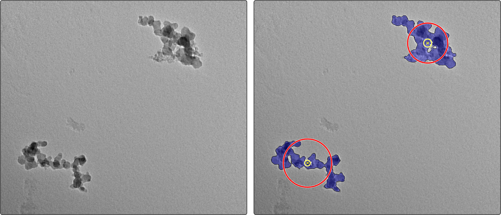

# ATEMS

**(*A*nalysis tools for *TEM* images of *S*oot)**

[](https://zenodo.org/badge/latestdoi/190795680)
[](https://lbesson.mit-license.org/)
[]()

This program contains Matlab code for several methods of characterizing soot aggregates in TEM images. This includes methods for evaluating the aggregate projected area, perimeter, and primary particle diameter. Methods include Otsu thresholding, the pair correlation method (PCM), Hough circle transform (following [Kook](kook)), and tools to aid in manual analysis. The program is primarily composed of two packages, which will be discussed later in the README: 

1. +agg - which performs aggregate-level segmentation to output a binary image, and 

2. +pp - which determines the primarily particle, often from the binary image generated by the methods in the `agg` package noted above. 

### Getting started

The first step in this process is to import images. Images are handled by way of a data structure that can be generated by way of a file explorer by calling 

```Matlab
Imgs = tools.load_imgs; % load the images
```

The output structure contains the image file name and directory; the image itself, with the footer cropped; and the pixel size, read from the image footer. The latter two operations make use of the get_footer_scale function, which requires a certain style footer that is consistent with TEM images taken at the University of British Columbia and applies optical character recognition to determine the pixel size (stored in the `pixsize` field). The images and pixel sizes can be extracted from this structure using:

```Matlab
imgs = {Imgs.cropped}; % copy variables locally
pixsize = [Imgs.pixsize];
fname = {Imgs.fname};
```

The next step is to evaluate binaries that separate parts of the image that are part of the background and parts that are aggregate. This is done using the agg package. A general, multipurpose segmentation can be evaluated using

```Matlab
imgs_binary = agg.seg(imgs, pixsize, opts); % segment aggregates
```

The result, `imgs_binary` is a cell or image binaries, with `1` if a pixel is considered part of the background and `0` if it is not. Examples of output from this kind of function include (from top to bottom) adaptive manual thresholding using a slide; Otsu thresholding with a rolling ball transformation; the preceding treatment using background correction; and the output segmented images from k-means. 


Aggregate characteristics can be determined by passing this binary image to an analysis function, specifically

```Matlab
Aggs = agg.analyze_binary(...
    imgs_binary,imgs,pixsize,fname);
        % determine aggregate properties
```

The output data itself, `Aggs`, is a MATLAB structured array with one entry per aggregate, containing properties like the location of the aggregate, perimeter, and projected-area. This data can then be exported to a JSON file using 

```Matlab
tools.write_json(Aggs, fname);
```

or an Excel spreadsheet using 

```Matlab
tools.write_excel(Aggs, fname);
```

to be analyzed in other software and languages, where `fname` is the filename of the file to write to. 

Primary particle size information can finally be determined using the `pp` package. The original pair correlation method (PCM), for example, can be applied by using the `Aggs` output from the `agg.analyze_binary` function as

```Matlab
Aggs_pcm = pp.pcm(Aggs); % apply PCM
```

The output is an updates `Aggs` structure that also contain the primary particle size information for each aggregate. Having done this, visuzlized the result using

```Matlab
figure(1);
tools.plot_aggregates(Aggs_edm);
```

As a sample, one can go from this image (with the footer already cropped) to a classified image that looks as follows:



Here, the blue highlighting indicates pixels that are part of the aggregate, the red circle indicated the projected-area equivalent diameter, the yellow circle the primary particle size from PCM, and the number indicating the index used by the program to identify each aggregate. 

## 1. Aggregate segmentation package (+agg)

This package contains an expanding library of functions aimed at performing semantic segmentation of the TEM images into aggregate and background areas. 

#### 1.1 agg.seg* functions

Functions implementing different methods of aggregate-level semantic segmentation have filenames starting with `agg.seg*`. The functions generally share two common inputs:

1. imgs - An unmodified (save for removing the footer) single image or cellular array of images  of the aggregates. 

2. pixsize - The size of each pixel in the image (often used in the rolling ball transformation). 

Other arguments depend on the function. 

The available methods are summarized below. In each case, efforts are ongoing to standardize the outputs, which primarily consist of binary images in which pixels identified as part of the aggregate are assigned a value of `1` and pixels in the background are assigned a value of `0`.

Other methods, beyond those below, are currently under development.

###### 1.1.1 seg_otsu_rb*

This method applies Otsu thresholding followed by a rolling ball transformation that fills gaps in the particles using the `rolling_ball` function included with this package, which performs a rolling ball transformation that i composed of iterative morphological iterations. Two versions of this function are included: 

1. seg_otsu_rb_orig - Remains true to the original code of [Dastanpour et al. (2016)][dastanpour2016]. 

2. seg_otsu_rb - Updates the above implementation by (*i*) not immediately removing boundary aggregates, (*ii*) adding a background subtraction step using the `agg.bg_subtract` function, and (*iii*) adding a denoising step. 

###### 1.1.2 seg_slider

This is a GUI-based method with a slider for *adaptive* manual thresholding of the image (adaptive in that small sections of the image can be cropped and thresholded independently). Gaussian denoising is first performed on the image to reduce the noise in the thresholded image. Then, a slider is used to manually adjust the level of the threshold. This is a variant of the method included with the distribution of the PCM code by [Dastanpour et al. (2016)][dastanpour2016], though it has seen considerable updates
since that implementation. 

Several sub-functions are included within the main file.

> We note that this code saw several important bug updates since the original code by [Dastanpour et al. (2016)][dastanpour2016]. This includes fixing how the original code would repeatedly apply a Gaussian filter every time the user interacted with the slider in the GUI (which may cause some backward compatibility issues), a reduction in the use of global variables, and significant memory savings.

###### 1.1.3 seg

This is included as a wrapper function (agg_det.m) that runs a
series of these other methods in series, prompting the user
if adequate thresholding was achieved by a given method.

#### 1.2 analyze_binary

This function analyzes the binary image output from any of the `agg.seg_*` functions. The output is a MATLAB structured array
containing information about the aggregate, such as area in pixels, radius of gyration, area-equivalent diameter, aspect ratio
etc., in an `Aggs` structured array. The array has one entry for each aggregate found in the image, defined as independent groupings of pixels. The function itself takes a binary image, the original image, and the pixel size as inputs, generating an `Aggs` structure by

```Matlab
Aggs = agg.analyze_binary(imgs_binary,imgs,pixsize,fname);
```

The `fname` argument is optional and adds this tag to the information in the output `Aggs` structure. 


## 2. Primary particle analysis package (+pp)

The +pp package contains multiple methods for determining the primary particle size of the aggregates of interest. Often this requires a binary mask of the image that can be generated using the +agg package methods.

#### 2.1 pcm

The University of British Columbia's pair correlation method (PCM) MATLAB code for processing TEM images of soot to determine morphological properties. This package contains a significant update to the previous code provided with [Dastanpour et al. (2016)][dastanpour2016].

#### 2.2 kook

This method contains a copy of the code provided by [Kook et al. (2015)][kook], with minor modifications to match in the input/output of some of the other packages. The method is based on using the Hough transform on a pre-processed image.

#### 2.3 kook_yl

This method contains a University of British Columbia-modified version of the method proposed by [Kook et al. (2015)][kook].

#### 2.4 manual

Code to be used in the manual sizing of soot primary particles developed at the University of British Columbia. The current method uses crosshairs to select the length and width of the particle. This is converted to various quantities, such as the mean primary particle diameter. The manual code is a heavily modified version of the code associated with [Dastanpour and Rogak (2014)][dastanpour2014].


## 3. Additional tools package (+tools)

This package contains a series of functions that help in visualizing or analyzing the aggregates.

#### 3.1 Plotting functions (plot*)

These functions aid in visualizing the results. For example, `plot_binary_overlay(...)` will plot the image and overlay labels for the aggregates in a corresponding binary image.

--------------------------------------------------------------------------

#### License

This software is licensed under an MIT license (see the corresponding file for details).


#### Contributors and acknowledgements

This code was primarily compiled by Timothy A. Sipkens while at the University of British Columbia (UBC), who can be contacted at [tsipkens@mail.ubc.ca](mailto:tsipkens@mail.ubc.ca). Pieces of this code were adapted from various sources and features snippets written by several individuals at UBC, including Ramin Dastanpour, [Una Trivanovic](https://github.com/unatriva), Yiling Kang, Yeshun (Samuel) Ma, and Steven Rogak, among others.

This program contains very significantly modified versions of the code distributed with [Dastanpour et al. (2016)][dastanpour2016]. The most recent version of the Dastanpour et al. code prior to this overhaul is available at https://github.com/unatriva/UBC-PCM (which itself presents a minor update from the original). That code forms the basis for some of the methods underlying the manual processing and the PCM method used in this code, as noted in the README above. However, significant optimizations have improved code legibility, performance, and maintainability (e.g., the code no longer uses global variables). 

Also included with this program is the Matlab code of [Kook et al. (2015)][kook], modified to accommodate the expected inputs and outputs common to the other functions.

Finally, this code contains an adaptation of the Euclidean distance mapping-surface based scale analysis presented by Bescond et al. Modifications to allow the method to work directly on binary images (rather than a custom output from ImageJ) and to integrate the method into the Matlab environment may present some minor compatibility issues, but allows use of the aggregate segmentation methods given in the `agg` package. . 

#### References

1. [Kook et al., SAE Int. J. Engines (2015).][kook]
2. [Dastanpour et al., J. Powder Tech. (2016).][dastanpour2016]
3. [Dastanpour and Rogak, Aerosol Sci. Technol. (2014).][dastanpour2014]

[kook]: https://doi.org/10.4271/2015-01-1991
[dastanpour2016]: https://doi.org/10.1016/j.powtec.2016.03.027
[dastanpour2014]: https://doi.org/10.1080/02786826.2014.955565
